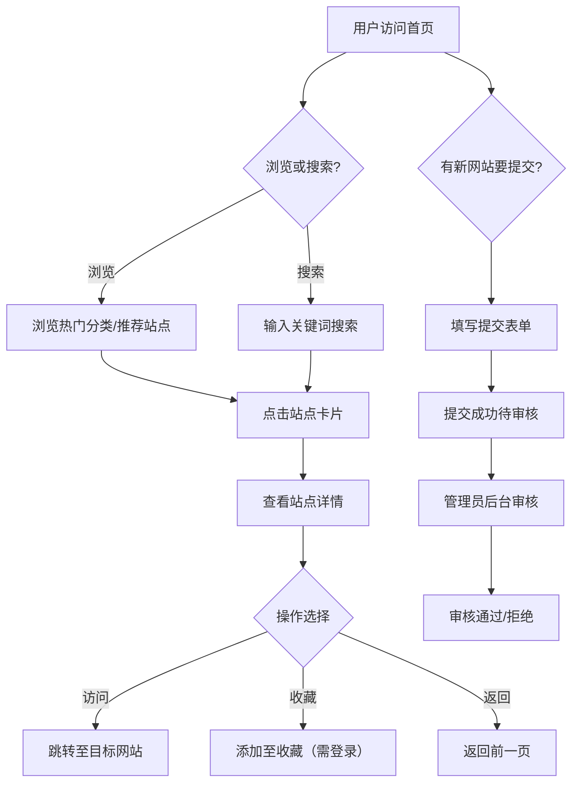

## 1. 产品概述

一个现代化、视觉惊艳的网站导航站，提供各类优质网站的收录、分类浏览与快捷导航功能。

- 主要目的：帮助用户发现和收藏优质网站资源，提供高效、优雅的浏览体验
- 目标用户：普通网民、设计师、开发者、产品经理等需要日常浏览大量网站的人群
- 产品价值：作为"书签管理器 + 发现引擎"，解决信息过载时代网址收藏与发现的痛点

## 2. 核心功能

### 2.1 用户角色

| 角色 | 注册方式 | 核心权限 |
|------|----------|----------|
| 浏览用户 | 无需注册 | 浏览首页、搜索、查看分类、查看详情 |
| 提交用户 | 邮箱注册 | 提交新网站、管理已提交网站 |
| 管理员 | 后台预设 | 审核提交、管理全部分类与网站、系统设置 |

### 2.2 功能模块

1. **首页**：推荐网站展示、热门分类入口、搜索入口、统计信息
2. **搜索页**：全局搜索、标签筛选、排序筛选
3. **分类页**：分类列表浏览、分类下网站展示
4. **详情页**：网站详细信息、描述、标签、外链跳转
5. **提交页**：表单提交新网站、分类选择、标签填写
6. **后台管理页**：网站管理、分类管理、提交审核、统计分析

### 2.3 页面详情

| 页面名称 | 模块名称 | 功能描述 |
|----------|----------|----------|
| 首页 | 顶部菜单栏 | 悬浮式菜单，桌面端在页面顶部悬浮，移动端在底部 |
| 首页 | Hero区域 | 大标题、副标题、搜索快捷入口、背景动效 |
| 首页 | 热门分类 | 展示6-8个热门分类卡片，点击跳转分类页 |
| 首页 | 推荐站点 | 展示12个精选推荐站点卡片 |
| 首页 | 统计信息 | 站点总数、分类总数、今日新增等 |
| 搜索页 | 搜索栏 | 输入关键词实时搜索，带清空按钮 |
| 搜索页 | 筛选栏 | 分类筛选、标签筛选、排序方式选择 |
| 搜索页 | 结果列表 | 搜索结果的卡片列表展示 |
| 分类页 | 分类列表 | 全部分类以卡片网格展示 |
| 分类页 | 分类站点 | 选中分类下的站点列表 |
| 详情页 | 网站信息 | Logo、名称、描述、标签、分类 |
| 详情页 | 操作按钮 | 访问链接、复制链接、收藏 |
| 提交页 | 提交表单 | 网站名称、URL、分类、标签、描述、Logo URL |
| 后台 | 站点管理 | 列表展示所有站点，支持审核/编辑/删除 |
| 后台 | 分类管理 | CRUD操作分类 |
| 后台 | 提交审核 | 待审核站点列表，通过/拒绝操作 |

## 3. 核心流程

## 4. 用户界面设计

### 4.1 设计风格

- **整体风格**：高透明玻璃拟态（Glassmorphism）+ 液态流动效果
- **主色调**：背景黑色(#0a0a0f) / 白色(#f0f0f5)，文字随背景反转
- **强调色**：渐变色（青蓝 #00d4ff → 紫 #7b2ff7）
- **圆角风格**：高圆角（16px-24px），按钮和卡片大圆角
- **玻璃效果**：`backdrop-filter: blur(20px)`，透明背景 `rgba(255,255,255,0.05)` 到 `rgba(255,255,255,0.1)`
- **字体**：标题使用 Noto Sans SC 加粗，正文使用系统字体
- **布局风格**：卡片网格布局，通栏设计，大量留白
- **动效风格**：平滑过渡、悬停放大、毛玻璃悬浮效果

### 4.2 页面设计概览

| 页面名称 | 模块名称 | UI元素 |
|----------|----------|--------|
| 首页 | Hero区域 | 渐变大标题、搜索输入框、背景动态光效、圆角玻璃容器 |
| 首页 | 分类卡片 | 圆角20px玻璃卡片、图标+文字、悬停上浮动效 |
| 首页 | 站点卡片 | 圆角16px玻璃卡片、favicon+标题+描述、悬停放大 |
| 搜索页 | 搜索栏 | 圆角24px玻璃输入框、搜索图标、清空按钮 |
| 搜索页 | 结果卡片 | 同首页站点卡片样式 |
| 分类页 | 分类卡片 | 同首页分类卡片，全部展示 |
| 详情页 | 详情卡片 | 大圆角玻璃容器、可交互按钮 |
| 提交页 | 表单 | 圆角16px玻璃输入框、按钮渐变色 |
| 后台 | 表格 | 简约表格、操作按钮、状态标签 |
| 菜单栏 | 悬浮菜单 | 毛玻璃背景、圆角24px、桌面水平/移动底部导航 |

### 4.3 响应式设计

- 桌面优先设计：1200px+ 宽屏优化
- 平板适配：768px-1199px，调整为2-3列
- 手机适配：<768px，单列布局，菜单移至底部
- 触控优化：按钮尺寸不小于44px，滑动流畅

### 4.4 动画效果

- 页面加载：卡片交错淡入上升动画
- 悬停效果：卡片上浮 8px，阴影加深，边框发光
- 菜单切换：平滑滑动过渡
- 搜索：输入防抖，结果渐入
- 背景：CSS-only 渐变流动动效