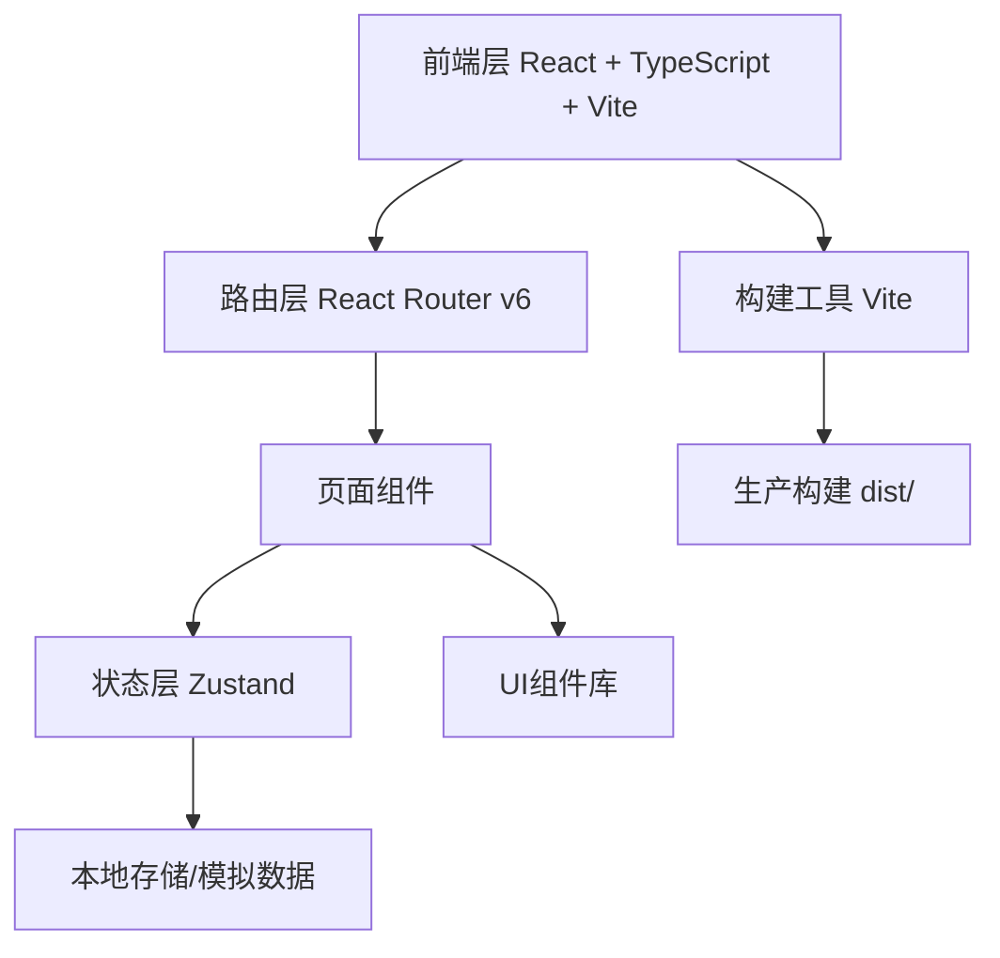

## 1. 架构设计



## 2. 技术选型

| 类别 | 技术 | 说明 |
|------|------|------|
| 前端框架 | React 18 + TypeScript | 类型安全，组件化开发 |
| 构建工具 | Vite 5 | 极速开发体验 |
| 路由 | React Router v6 | 声明式路由 |
| 状态管理 | Zustand | 轻量级状态管理 |
| CSS方案 | Tailwind CSS v3 | 工具类优先，快速样式开发 |
| 图标 | Lucide React | 统一图标库 |
| 包管理器 | pnpm | 高效包管理 |

## 3. 路由定义

| 路由 | 页面 | 说明 |
|------|------|------|
| `/` | 首页 | 推荐站点 + 热门分类 |
| `/search` | 搜索页 | 全局搜索与筛选 |
| `/categories` | 分类页 | 全部分类浏览 |
| `/category/:id` | 分类详情 | 某分类下的站点列表 |
| `/detail/:id` | 详情页 | 站点详细信息 |
| `/submit` | 提交页 | 提交新站点 |
| `/admin` | 后台管理 | 站点/分类管理 |
| `/admin/sites` | 后台-站点管理 | 站点CRUD |
| `/admin/categories` | 后台-分类管理 | 分类CRUD |
| `/admin/reviews` | 后台-审核管理 | 提交审核 |

## 4. 数据模型

### 4.1 数据模型定义（模拟数据）

```typescript
// 分类
interface Category {
  id: string;
  name: string;
  icon: string;
  description: string;
  siteCount: number;
  color: string; // 分类主题色
}

// 站点
interface Site {
  id: string;
  name: string;
  url: string;
  description: string;
  logo: string; // favicon URL
  categoryId: string;
  tags: string[];
  status: 'approved' | 'pending' | 'rejected';
  createdAt: string;
  visitCount: number;
  isRecommended: boolean;
}

// 提交表单
interface SubmitForm {
  name: string;
  url: string;
  description: string;
  categoryId: string;
  tags: string[];
  logo?: string;
  email: string;
}
```

### 4.2 目录结构

```
/workspace/
├── public/
│   └── favicon.svg
├── src/
│   ├── components/       # 公共组件
│   │   ├── Navbar.tsx    # 悬浮菜单栏
│   │   ├── SiteCard.tsx  # 站点卡片
│   │   ├── CategoryCard.tsx # 分类卡片
│   │   ├── SearchBar.tsx # 搜索栏
│   │   ├── GlassCard.tsx # 玻璃卡片容器
│   │   └── Layout.tsx    # 页面布局
│   ├── pages/            # 页面组件
│   │   ├── Home.tsx
│   │   ├── Search.tsx
│   │   ├── Categories.tsx
│   │   ├── CategoryDetail.tsx
│   │   ├── Detail.tsx
│   │   ├── Submit.tsx
│   │   └── admin/
│   │       ├── AdminLayout.tsx
│   │       ├── Sites.tsx
│   │       ├── Categories.tsx
│   │       └── Reviews.tsx
│   ├── store/            # Zustand 状态管理
│   │   └── index.ts
│   ├── data/             # 模拟数据
│   │   └── mock.ts
│   ├── types/            # 类型定义
│   │   └── index.ts
│   ├── hooks/            # 自定义 hooks
│   │   └── useTheme.ts
│   ├── utils/            # 工具函数
│   │   └── index.ts
│   ├── App.tsx           # 应用入口
│   ├── main.tsx          # 渲染入口
│   └── index.css         # 全局样式
├── index.html
├── package.json
├── tsconfig.json
├── tsconfig.node.json
├── tailwind.config.js
├── postcss.config.js
└── vite.config.ts
```

## 5. 无后端方案

本项目前期为纯前端实现，使用模拟数据（mock data）进行开发。后续可对接后端 API：

- 模拟数据位于 `src/data/mock.ts`
- 通过 Zustand store 管理数据状态，方便后续替换为 API 调用
- 使用 `setTimeout` 模拟异步请求延迟